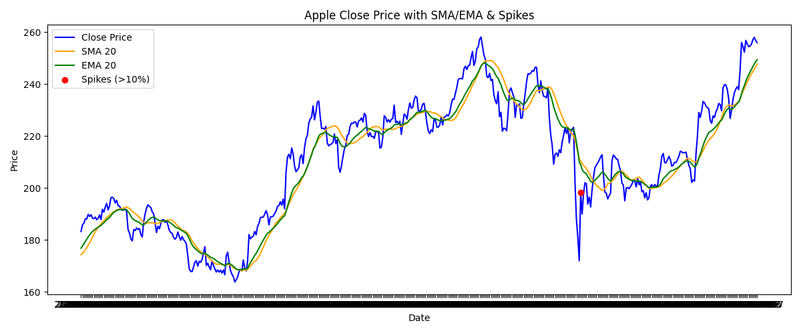

[](https://opensource.org/licenses/Apache-2.0)

#  Apple Stock Data Demo (AI-Ready Dataset)

##  Overview
This demo project prepares a **clean, structured financial dataset** for the Apple Inc. (AAPL) stock, covering the last 2 years.  
It demonstrates data collection, cleaning, feature engineering, visualization, and reporting — suitable for **AI model training**, financial analytics, or forecasting prototypes.

---

##  Workflow

### 1. Data Source
- **Yahoo Finance API** via [`yfinance`](https://pypi.org/project/yfinance/)  
- All data are **public market data** (no personal information is used)

### 2. Data Preparation
- Retrieve 2-year historical OHLCV data  
- Add fundamental data: financials, balance sheet, cashflow  
- Handle missing values (forward fill)  
- Remove duplicates and invalid (negative) entries  
- Convert dates to ISO format (`YYYY-MM-DD`)

### 3. Feature Engineering
Calculated using [`ta`](https://technical-analysis-library-in-python.readthedocs.io/en/latest/):
- **SMA_20**: Simple Moving Average (20-day)
- **EMA_20**: Exponential Moving Average (20-day)
- **RSI_14**: Relative Strength Index (14-day)
- **MACD**: Moving Average Convergence Divergence
- **Return**: Daily % change of closing price

### 4. Validation
- Checks for missing or negative values  
- Detection of extreme daily changes (>10%)  
- Cross-checks against Yahoo Finance for data integrity

### 5. Visualization
Line charts showing:
- Close Price  
- SMA 20  
- EMA 20  
- Highlighted spikes (>10% daily return)



### 6. Summary Report (PDF)
Generated using [`reportlab`](https://pypi.org/project/reportlab/):
- Aggregated statistics (mean, std, min, max)  
- Table of extreme daily returns (>10%)  
- Ready for documentation or presentation
<a href="apple_summary_report.pdf" target="_blank">📄 View Summary Report (PDF)</a>
---

## How to Run

### Prerequisites
Install required libraries:
```bash
cd Desktop
```
```bash
mkdir AI-FINANCE
```
```bash
cd AI-FINANCE
```
```bash
python -m venv venv
```
```bash
venv\Scripts\activate
```
```bash
pip install yfinance ta matplotlib reportlab pandas
```
Download the script file **`demo_dataset.py`** from this repository
- Go to the GitHub page of this project  
- Click on the file **`demo_dataset.py`**
- In the top right, click **“Download raw file”** (it will usually go to your **Downloads** folder)
- Move or copy the saved file into your project folder: AI-FINANCE
  
```bash
python demo_dataset.py
```
---

## Usage Notes
- The script and report can be used for analytics, AI model training prototypes, or forecasting demonstrations.
- Raw Yahoo Finance data are **not included**; only scripts and reports are provided.

## Legal Disclaimer & License

- The scripts in this project are original work by the author and are licensed under the **Apache License 2.0**. See the [LICENSE](LICENSE) file for full details.
- The Python code downloads **publicly available Apple Inc. (AAPL) stock data** via the Yahoo Finance API (`yfinance` library).
- All data processing, cleaning, feature engineering, technical indicator calculations, visualizations, and PDF reports are performed locally by the scripts.
- **Raw Yahoo Finance data are not included** in this repository and may **not be used for commercial purposes**.
- This project is intended strictly for **educational, research, and demonstration purposes** (e.g., AI model training, financial analysis, forecasting prototypes).
- The author provides **no financial advice** and assumes **no responsibility for investment decisions** made using the outputs of this project.
- Users are solely responsible for any **commercial or production use** of the data or outputs generated by this code.

See also the [NOTICE](NOTICE) file for full attribution and data source information.

